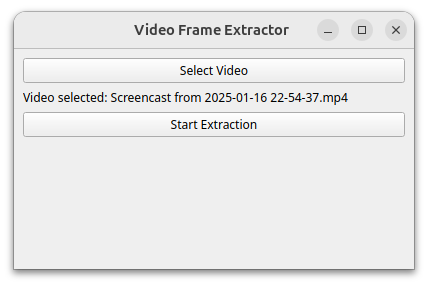
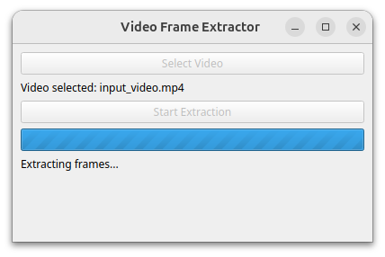

# Video Frame Extractor

**Video Frame Extractor** is a desktop application developed in Python using PyQt5. It allows extracting all frames from a video using ffmpeg. The interface is multilingual, displaying text in English by default, but it automatically adapts to Spanish, German, French, Portuguese, or Russian based on the system language.

<p align="center">
  
  
</p>

## Features

- **Frame Extraction:** Extracts all frames from a video and saves them in a folder named after the video file followed by `_frames`.
- **Multilingual Interface:** Supports English, Spanish, German, French, Portuguese, and Russian. The system language is detected automatically.
- **Simple Interface:** Clear buttons and messages to select the video and track the extraction progress.

## Requirements

- **Python 3.x**
- **PyQt5:**
- **ffmpeg**

## Installation

1. **Clone or download the repository:**
   ```bash
   git clone https://github.com/tomas-salvador/Video-Frame-Extractor
2. **Install the required dependencies:**
   ```bash
   pip install PyQt5
   pip install ffmpeg

## Usage

1. **Run the application:**

   ```bash
   python main.py
2. **Select the video:**
   Click the "Select Video" button (or its equivalent in your language) and choose the desired video file.
3. **Start extraction:**
   Click "Start Extraction" to begin the process. A progress bar will be displayed in indeterminate mode during extraction.
4. **Review the extracted frames:**
   Once the process is complete, a folder will be created in the same location as the video, named <video_name>_frames, containing all frames in JPEG format.

## Notes

- The application uses ffmpeg for frame extraction, so it is essential that it is correctly installed and configured in the system PATH.
- The interface language is automatically detected using QLocale from PyQt5. If the system language is not supported (Spanish, German, French, Portuguese, or Russian), the interface will be displayed in English.
- If an error occurs during extraction, a detailed message will indicate the cause.

## Contributing

Feel free to open Issues or submit Pull Requests if you want to improve or extend the functionality.

## License

Distributed under the [MIT License](LICENSE).
